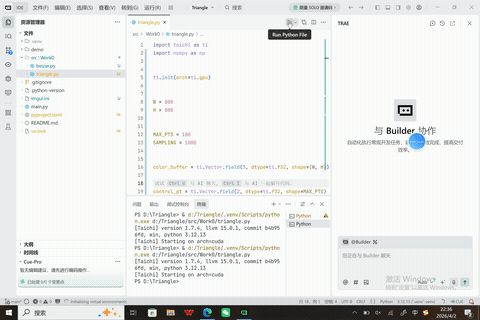

# Bezier曲线 效果展示

- 占博文 202411081043 人工智能
## 效果演果

## 一、项目简介
本项目为计算机图形学曲线建模核心实验，基于 Python 从零手写贝塞尔曲线（Bezier Curve）生成算法。摒弃第三方图形绘图接口，通过伯恩斯坦基函数公式、德卡斯特里奥细分算法，实现二阶、三阶贝塞尔曲线的动态生成、控制点拖拽、实时刷新绘制，完整还原参数曲线的图形学底层原理，是曲面建模、动画轨迹、矢量绘图的基础核心实验。
## 二、项目目录结构
Bezier/
├── src/Work0/                # 核心实验源码目录
├── main.py                   # 程序入口、曲线绘制主函数
├── o6zRnmeG_converted.gif    # 项目效果演示动图
├── 曲线.mp4                  # 实验视频演示
├── imgui.ini                 # 界面配置文件
├── .gitignore                # 忽略虚拟环境、缓存文件
├── .python-version           # Python 版本锁定
├── pyproject.toml            # 项目依赖配置
├── uv.lock                   # 依赖版本锁定文件
└── README.md                 # 项目说明文档
## 三、运行环境与依赖
- Python 版本：3.10+
- 环境说明：本地虚拟环境 .venv 已忽略，不提交仓库
- 依赖管理：支持 uv / pip 安装依赖
## 四、运行指令
项目根目录直接运行：
python main.py
## 五、核心算法原理
1. 贝塞尔曲线概述
贝塞尔曲线是计算机图形学中最经典的参数光滑曲线，通过少量控制点控制整体曲线形态，具备局部调整、光滑连续、易于计算机运算的特点，广泛应用于矢量绘图、字体设计、三维曲面建模、动画运动轨迹生成等场景。曲线形态完全由控制点数量与位置决定。
2. 数学核心公式
n 阶贝塞尔曲线通用计算公式：
$$B(t) = \sum_{i=0}^{n} P_i \cdot C_n^i \cdot t^i \cdot (1-t)^{n-i},\quad t\in[0,1]$$
其中：$$P_i$$ 为控制点坐标，$$C_n^i$$ 为组合数，$$t$$ 为插值参数。
二阶贝塞尔曲线（三点控制）：具备基础弧度弯曲效果，适用于简单圆弧绘制。
三阶贝塞尔曲线（四点控制）：拥有两个调节段，可绘制 S 型、复杂平滑曲线，是工业设计主流曲线。
3. 德卡斯特里奥细分算法（核心实现）
本项目采用数值稳定性更高的德卡斯特里奥递归细分算法生成曲线，替代直接计算组合数，避免高阶运算误差，核心流程：
步骤1：线性插值
根据参数 t，对每一组相邻控制点做线性插值，生成新的中间点。
步骤2：逐层递归
不断对上一轮生成的中间点重复插值，层层收敛。
步骤3：生成曲点
递归至最后仅剩一个点，该点即为当前 t 参数对应的曲线上像素点。
步骤4：逐点采样
将 t 从 0 到 1 均匀采样，生成无数曲点，连接形成完整光滑贝塞尔曲线。
4. 贝塞尔曲线核心特性
- 端点插值性：曲线必定经过首尾两个控制点，保证轨迹起止精准；
- 凸包性：曲线整体完全包裹在控制点形成的凸多边形内，形态可控；
- 几何不变性：平移、旋转控制点，曲线同步变换，无形态畸变；
- 全局关联性：低阶曲线单个控制点改动会影响整条曲线形态。
## 六、项目核心功能
- 支持二阶、三阶贝塞尔曲线自定义绘制
- 可视化展示所有控制点与辅助连线
- 参数均匀采样，生成高光滑度曲线
- 实时渲染刷新，动态观察曲线形态变化
- 纯算法实现，完整保留底层数学逻辑
## 七、项目特点
- 原理透明：不依赖图形库曲线绘制接口，手写细分插值算法
- 可视化直观：控制点、辅助线、最终曲线分层展示，便于理解原理
- 拓展性强：可快速拓展多段曲线拼接、闭合曲线、曲面生成功能
- 适配课程作业：算法原理完整、逻辑清晰，可直接用于实验报告撰写

## 项目说明
- 项目核心代码存放于 src/ 目录
- 本地虚拟环境 .venv 已忽略
